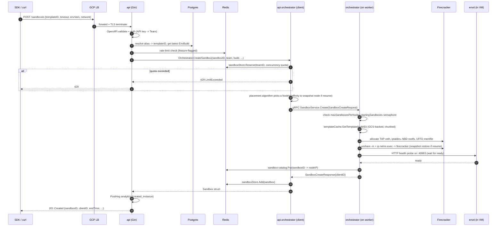
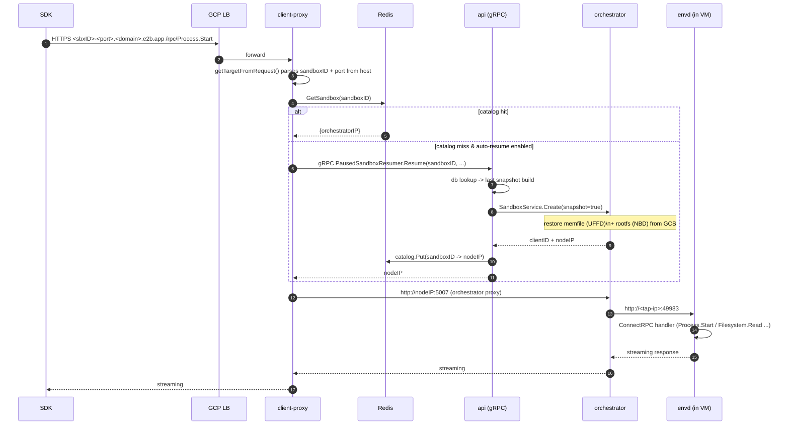
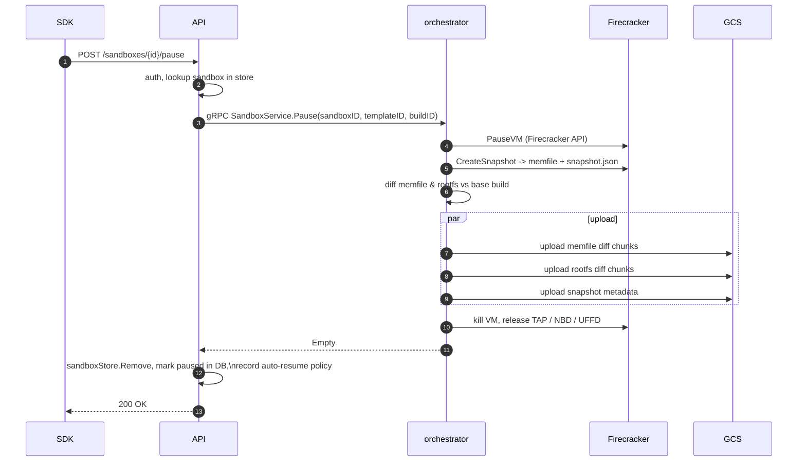
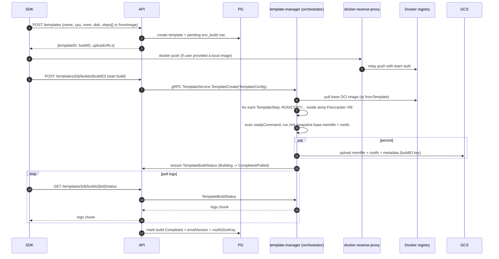
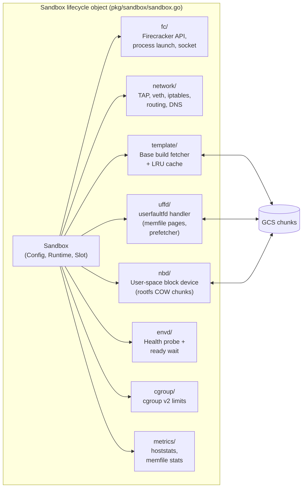
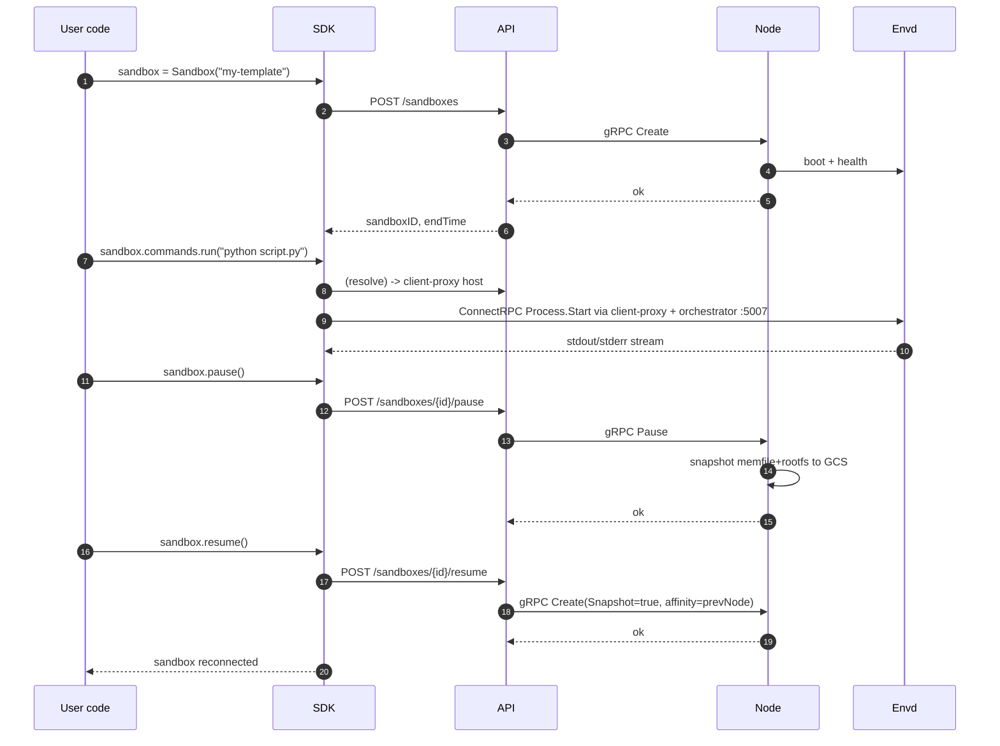

# E2B Infrastructure – Architecture

This document is a walk-through of how `e2b-infra` works end-to-end: what each
service does, how they talk to each other, and what happens during the main
sandbox lifecycle flows (create / request / pause / resume / template build).

All Mermaid diagrams below render in GitHub, Cursor, and VS Code.

> Companion docs:
> - [`README.md`](./README.md) – project intro
> - [`CLAUDE.md`](./CLAUDE.md) – common dev commands + per-package notes
> - [`DEV.md`](./DEV.md) / [`DEV-LOCAL.md`](./DEV-LOCAL.md) – local / remote dev
> - [`self-host.md`](./self-host.md) – self-hosting guide
> - [`spec/openapi.yml`](./spec/openapi.yml) – public REST API surface

---

## 1. What this repository is

E2B is an open-source cloud platform for running AI-generated code inside
secure, isolated sandboxes. This repo is the **backend infrastructure** that:

- Exposes a REST API for the E2B SDKs (`e2b`, `e2b-code-interpreter`, CLI).
- Schedules and runs **Firecracker microVMs** (each = one "sandbox") on
  Nomad-managed GCP / AWS nodes.
- Routes user traffic into the running VMs.
- Supports build / pause / resume / snapshot of sandbox state.
- Runs a daemon inside each VM (`envd`) that the SDK calls for process,
  filesystem, and pseudo-terminal operations.

Stack: Go 1.25 workspaces, PostgreSQL (sqlc), Redis, ClickHouse, Firecracker,
Nomad, Consul, Terraform, OpenTelemetry + Grafana (Loki / Tempo / Mimir).

---

## 2. Core services

| Package | Role | Protocol / Port |
|---|---|---|
| `packages/api` | Public REST API (Gin + oapi-codegen). Auth (API key / Supabase / admin), CRUD of sandboxes, templates, teams, volumes. Also hosts a gRPC server used by `client-proxy` for on-demand resume. | REST `:80`, gRPC (configurable) |
| `packages/client-proxy` | Edge HTTP proxy. Maps `<id>-<port>.<domain>` → `sandboxID + port` and forwards to the right orchestrator node. Uses a Redis-backed **sandbox catalog**. Triggers auto-resume on cache miss. | HTTP `:ProxyPort` |
| `packages/orchestrator` | Node-level daemon running on every sandbox host. Boots / pauses / snapshots Firecracker VMs, wires up TAP network, NBD block devices, UFFD memory, talks to Envd. Hosts gRPC `SandboxService` + `TemplateService` + an internal HTTP proxy (`:5007`) into the VMs. | gRPC + HTTP `:5007` |
| `packages/envd` | Tiny daemon baked **inside** every sandbox rootfs. ConnectRPC server exposing `Process` + `Filesystem` APIs, plus chi HTTP routes, plus port-forwarder that exposes any port opened inside the VM to the outside. | HTTP `:49983` |
| `packages/shared` | Cross-cutting libs: generated gRPC stubs (`orchestrator`, `envd`), OTEL telemetry, zap logger, storage (GCS/S3), Redis factories, feature flags (LaunchDarkly), sandbox catalog, reverse proxy, rate-limit. |
| `packages/db` | `goose` migrations + `sqlc` queries producing typed Go code used by API / orchestrator. |
| `packages/auth` | Shared auth middleware (API key / Supabase JWT / access token / admin token). |
| `packages/clickhouse` | Host / sandbox stats + events ingestion. |
| `packages/docker-reverse-proxy` | Proxies docker-registry pushes (used while building templates from OCI images). |
| `packages/dashboard-api` | Internal REST API for the dashboard. |
| `packages/otel-collector`, `packages/nomad-nodepool-apm` | Telemetry infra. |
| `iac/` | Terraform for GCP + AWS, Packer-built Nomad worker image, Nomad job HCLs for each service. |
| `spec/` | `openapi.yml` (API surface) + proto for envd (`process`, `filesystem`). |

---

## 3. High-Level Design (HLD)

```mermaid
flowchart TB
  subgraph Client["End user / SDK"]
    SDK["E2B SDK (JS/Python/CLI)"]
  end

  subgraph Edge["Edge layer (GCP LB / Cloudflare)"]
    LB[(HTTPS Load Balancer)]
  end

  subgraph ControlPlane["Control plane - Nomad jobs"]
    API["packages/api\nREST + gRPC\n(Gin, oapi-codegen)"]
    CP["packages/client-proxy\nHTTP reverse proxy"]
    TM["template-manager\n(orchestrator binary,\ntemplate build role)"]
    DASH["dashboard-api"]
    DRP["docker-reverse-proxy"]
  end

  subgraph Data["Stateful services"]
    PG[(PostgreSQL\nsqlc)]
    REDIS[(Redis\ncatalog, cache,\nrate-limit)]
    CH[(ClickHouse\nmetrics, events)]
    GCS[(GCS / S3\ntemplate blobs,\nsnapshots)]
  end

  subgraph DataPlane["Data plane - Nomad worker pool (one per VM host)"]
    ORCH["packages/orchestrator\n(root process)"]
    subgraph Host["Host OS"]
      FC1["Firecracker VM #1\n(microVM)"]
      FC2["Firecracker VM #2"]
      FC3["Firecracker VM #N"]
    end
    ORCH -- fork/exec + gRPC --> FC1
    ORCH --> FC2
    ORCH --> FC3
  end

  subgraph Inside["Inside each Firecracker VM"]
    ENVD["envd daemon\n:49983\n(ConnectRPC + HTTP)"]
    UserProc["User processes\n/home/user/..."]
  end

  subgraph Obs["Observability"]
    OTEL["OTEL Collector"]
    Loki[(Loki)]
    Tempo[(Tempo)]
    Mimir[(Mimir)]
    Grafana["Grafana"]
  end

  SDK -->|HTTPS REST\n/sandboxes, /templates| LB --> API
  SDK -->|HTTPS\nsandbox traffic\n<id>-<port>.e2b.app| LB --> CP
  API <-->|sqlc| PG
  API <-->|cache, ratelimit| REDIS
  API -->|analytics| CH
  API -->|gRPC SandboxService.Create\n(to scheduled node)| ORCH
  TM -->|gRPC TemplateService| ORCH
  CP -->|lookup sandboxID -> nodeIP| REDIS
  CP -->|gRPC PausedSandboxResumer| API
  CP -->|HTTP :5007| ORCH
  ORCH -->|HTTP proxy into VM| ENVD
  ENVD --> UserProc
  ORCH <-->|snapshots, memfile, rootfs| GCS
  TM <-->|template artifacts| GCS
  ORCH --> OTEL
  API --> OTEL
  CP --> OTEL
  ENVD --> OTEL
  OTEL --> Loki
  OTEL --> Tempo
  OTEL --> Mimir
  Grafana --> Loki
  Grafana --> Tempo
  Grafana --> Mimir
```

### Key design choices

- **Two planes.** API / client-proxy / template-manager are stateless
  control-plane jobs (`iac/modules/job-api`, `job-client-proxy`,
  `job-template-manager`). Orchestrator runs on dedicated worker nodes with
  hardware virtualization, NBD kernel module, hugepages, Firecracker binaries,
  Envd binary baked in (`iac/provider-gcp/nomad-cluster-disk-image/`).
- **Strict service isolation via gRPC.** API never touches Firecracker
  directly; it only calls `orchestrator.SandboxService` (see
  [`packages/orchestrator/orchestrator.proto`](./packages/orchestrator/orchestrator.proto)).
- **Sandbox catalog in Redis** is the source of truth for
  `sandboxID → (nodeIP, orchestratorInfo)`. Populated by the orchestrator on
  Create, read by the client-proxy on every request
  (`packages/shared/pkg/sandbox-catalog`).
- **Snapshots = pause/resume.** Memory (`memfile` via UFFD) and rootfs
  (via NBD) are copy-on-write, chunked, and uploaded to GCS; resume streams
  chunks back lazily with prefetch.
- **Templates = reusable sandbox rootfs** built by template-manager from
  Dockerfile-like steps; see
  [`packages/orchestrator/template-manager.proto`](./packages/orchestrator/template-manager.proto).
- **Code generation.** `spec/openapi.yml` →
  `packages/api/internal/api/*.gen.go`; proto in
  `packages/orchestrator/*.proto` and `packages/envd/spec/*` →
  `packages/shared/pkg/grpc/**`; `packages/db/queries/*.sql` → typed sqlc
  code.

---

## 4. Sequence diagrams for the main flows

### 4.1 Create a sandbox (`POST /sandboxes`)

Code path:

- `packages/api/internal/handlers/sandbox_create.go` → `PostSandboxes`
- `packages/api/internal/handlers/sandbox.go` → `startSandbox`
- `packages/api/internal/orchestrator/create_instance.go` →
  `Orchestrator.CreateSandbox` (placement + `Reserve` + gRPC)
- `packages/orchestrator/pkg/server/sandboxes.go` → `Server.Create`
  (template fetch, VM boot)



Notes:

- The API is **thin**: validate → pick node → delegate. All VM mechanics happen
  on the orchestrator.
- `Reserve` (in `packages/api/internal/sandbox/`) enforces per-team
  concurrency and also **coalesces duplicate creates** (if the same
  `sandboxID` is already starting, later callers get a `waitForStart` that
  returns the same result).
- Placement (`packages/api/internal/orchestrator/placement/`) considers node
  health, labels (feature-flagged label-based scheduling), and affinity.

### 4.2 Executing code / using the sandbox (SDK → envd)

Traffic flow for any call the SDK makes to a running sandbox (exec a command,
read a file, HTTP request to a port the user opened inside the VM, etc.).



- Subdomain encoding: the SDK URL looks like
  `49983-abc123-sandbox.<domain>` → `sandboxID = abc123-sandbox`,
  `port = 49983` (default envd port), or any port the user opened inside the
  VM.
- The orchestrator internal proxy at `:5007`
  (`packages/orchestrator/pkg/proxy/`) is what actually forwards into the
  Firecracker TAP device.
- Envd auth: optional `envdAccessToken` passed in headers
  (`proxygrpc.MetadataEnvdHTTPAccessToken`) + optional `trafficAccessToken`
  if the sandbox has public-access disabled.

### 4.3 Pause sandbox (`POST /sandboxes/{id}/pause`)

- Handler: `packages/api/internal/handlers/sandbox_pause.go`
- Orchestrator: `Server.Pause` + `sandbox.Snapshot` in
  `packages/orchestrator/pkg/sandbox/snapshot.go`



Important: Firecracker snapshots are split into (a) memfile (the VM RAM dump),
(b) rootfs diff, (c) a small JSON. They're stored as **sparse chunked diffs**
rooted on the original build, so pause is O(pages-written), not O(RAM). See
`packages/orchestrator/pkg/sandbox/block/`, `.../uffd/`, `.../nbd/`.

### 4.4 Resume sandbox

Essentially the same as **Create** with `isResume=true` and `Snapshot=true` in
`SandboxConfig`. Two differences:

```mermaid
sequenceDiagram
  autonumber
  participant Caller as SDK or client-proxy
  participant API
  participant ORCHM as api.orchestrator
  participant Node as orchestrator (affinity target)
  participant GCS

  Caller->>API: POST /sandboxes/{id}/resume (or gRPC Resume)
  API->>API: fetch snapshot metadata from DB (templateID + build)
  API->>ORCHM: CreateSandbox(isResume=true, nodeAffinity=snapshotNode)
  ORCHM->>Node: SandboxService.Create(Snapshot=true)
  Node->>GCS: stream-read memfile & rootfs chunks (lazy via UFFD/NBD)
  Note over Node: pages are faulted in on-demand;\nprefetch goroutine warms hot ranges
  Node->>Node: Firecracker LoadSnapshot -> ResumeVM
  Node-->>ORCHM: clientID
  ORCHM-->>API: Sandbox
  API-->>Caller: 200 {sandboxID, ...}
```

- The API **prefers the original snapshot node** (`sbxData.NodeID`) so warm
  disk caches are reused
  (`packages/api/internal/orchestrator/create_instance.go`).
- If that node is not `Ready`, it falls through to the placement algorithm.
- Resume is also reachable implicitly: the client-proxy triggers it on the
  first incoming HTTP request after a pause
  (`packages/client-proxy/internal/proxy/proxy.go`).

### 4.5 Build a template

- Handlers: `packages/api/internal/handlers/template_request_build_v3.go`,
  `template_start_build_v2.go`
- Uses the same orchestrator binary, but reaches the `TemplateService`
  (see `template-manager.proto`) running as the `template-manager` Nomad job.



---

## 5. Sandbox internals

Inside `packages/orchestrator/pkg/sandbox`, the VM is composed of several
layered components. You can view them as subsystems:



- **Block layer** (`block/`): pluggable sources — GCS-backed chunked storage,
  NFS cache, local file — used by both UFFD and NBD.
- **Diff creation** (`diffcreator.go`): during pause, walks dirty pages /
  blocks and produces the minimal diff against the base build.
- **Cleanup** (`cleanup.go`): a stack of deferred teardown actions so that
  partial starts don't leak TAP devices / mounts / FDs.

---

## 6. Sandbox isolation model (does *not* use Firecracker `jailer`)

E2B **does not** use the Firecracker [`jailer`](https://github.com/firecracker-microvm/firecracker/blob/main/docs/jailer.md)
binary. The orchestrator launches `firecracker` directly and reimplements the
jailer's responsibilities in Go, with a few additions (NBD/UFFD, egress proxy,
atomic cgroup placement).

Exact launch command (see
[`packages/orchestrator/pkg/sandbox/fc/script_builder.go`](./packages/orchestrator/pkg/sandbox/fc/script_builder.go)
and [`fc/process.go`](./packages/orchestrator/pkg/sandbox/fc/process.go)):

```bash
unshare -m -- bash -c '
  mount --make-rprivate / &&
  mount -t tmpfs tmpfs <SandboxDir> -o X-mount.mkdir &&
  ln -s <HostRootfsPath> <SandboxDir>/<rootfs> &&
  ln -s <HostKernelPath>  <SandboxDir>/<kernelDir>/<kernel> &&
  ip netns exec <NamespaceID> <FirecrackerPath> --api-sock <FirecrackerSocket>
'
```

…spawned with `SysProcAttr{Setsid: true, UseCgroupFD: true, CgroupFD: ...}` so
the FC child lands in the correct cgroup atomically via `CLONE_INTO_CGROUP`.

Isolation layers applied per sandbox:

| Layer | Implementation |
|---|---|
| Hardware virtualization | KVM (primary boundary) |
| Hypervisor syscall filter | Firecracker's built-in seccomp filter (enabled by default in FC) |
| Network namespace | `network.Slot` allocates a per-sandbox netns; FC launched via `ip netns exec` (`pkg/sandbox/network/`) |
| Mount namespace | `unshare -m` + `mount --make-rprivate /` + tmpfs + symlinks so the VM only sees its own files |
| cgroup v2 | Per-sandbox cgroup, atomic placement through `CLONE_INTO_CGROUP` (`pkg/sandbox/cgroup/manager.go`) |
| Session isolation | `Setsid: true` on the FC process |
| Per-sandbox firewall | `iptables` rules inside the netns + user-space egress proxy for domain allow-lists (`pkg/sandbox/network/firewall.go`, `egressproxy.go`) |
| Rate limiting | Native Firecracker token-bucket rate limiters on TAP + drive devices (`fc.RateLimiterConfig`) |
| Storage indirection | Rootfs served via **NBD** (`pkg/sandbox/nbd/`), memory via **UFFD** (`pkg/sandbox/uffd/`) — FC never sees the raw backing files |
| Inside-VM resource caps | `envd` cgroup v2 manager applies `cpu.weight` / `memory.high` / `memory.max` to PTY, socat, and user process groups (`packages/envd/main.go:createCgroupManager`) |

What is **not** done (vs. jailer defaults):

- FC does not run as an unprivileged UID/GID — the orchestrator requires root
  (`CLAUDE.md`: "Orchestrator requires sudo"). Unprivileged drop would
  complicate TAP/NBD/UFFD setup, so the project relies on the KVM + seccomp
  boundary instead.
- No `chroot` on the FC process itself. The `pkg/chrooted/` package is used
  only for template-build rootfs manipulation and the NFS proxy
  (`pkg/nfsproxy/chroot/`), not for sandbox runtime.
- No AppArmor / SELinux profile is added by the orchestrator.

## 7. Authentication model

From `spec/openapi.yml` + `packages/auth`:

- `X-API-Key: e2b_...` → team scope (most SDK calls).
- `Authorization: Bearer <access_token>` → user-level access tokens (CLI).
- `X-Supabase-Token` + `X-Supabase-Team` → dashboard (web app).
- `X-Admin-Token` → internal admin routes
  (`packages/api/internal/handlers/admin*.go`).

The OpenAPI file lists the Supabase schemes as `Supabase1TokenAuth` /
`Supabase2TeamAuth` specifically so `oapi-codegen` processes the user token
before the team (see the comment near the top of `spec/openapi.yml`).

---

## 8. Observability, deployment, CI

- **Telemetry.** Every service calls `telemetry.New(...)` at boot → OTEL SDK →
  collector → Loki / Tempo / Mimir. See `packages/shared/pkg/telemetry` and
  the middleware in `packages/shared/pkg/middleware/otel/*`.
- **Deployment.** `iac/provider-gcp/` (Terraform) provisions:
  - VPC + LB (`nomad-cluster/network/`)
  - Nomad server cluster + Consul (`nomad-cluster/`)
  - Worker nodepool from a Packer image
    (`provider-gcp/nomad-cluster-disk-image/`) that has the NBD module,
    Firecracker binaries, kernels, and envd baked in.
  - Filestore (NFS) for build caches (`nomad-cluster/filestore/`)
  - A **Nomad job per service** (`iac/modules/job-*`) deployed to the
    cluster.
- **CI/CD.** GitHub Actions in `.github/workflows/`:
  - `pr-tests.yml` (unit + lint)
  - `integration_tests.yml`
  - `build-and-upload-job.yml` (container builds to GAR)
  - `deploy-infra.yml` (Terraform apply)

---

## 9. The "happy path" in one diagram



---

## 10. Where to read next

If you want to keep drilling down:

1. **API surface (source of truth):** [`spec/openapi.yml`](./spec/openapi.yml)
   – every route, param, response.
2. **Orchestrator proto (internal contract):**
   [`packages/orchestrator/orchestrator.proto`](./packages/orchestrator/orchestrator.proto),
   [`packages/orchestrator/template-manager.proto`](./packages/orchestrator/template-manager.proto).
3. **Create flow end-to-end:**
   [`packages/api/internal/handlers/sandbox_create.go`](./packages/api/internal/handlers/sandbox_create.go)
   → [`packages/api/internal/orchestrator/create_instance.go`](./packages/api/internal/orchestrator/create_instance.go)
   → [`packages/orchestrator/pkg/server/sandboxes.go`](./packages/orchestrator/pkg/server/sandboxes.go).
4. **Firecracker mechanics:** `packages/orchestrator/pkg/sandbox/`
   (especially `sandbox.go`, `snapshot.go`, `fc/`, `uffd/`, `nbd/`,
   `network/`).
5. **Client proxy & auto-resume:**
   [`packages/client-proxy/internal/proxy/proxy.go`](./packages/client-proxy/internal/proxy/proxy.go)
   + `packages/shared/pkg/proxy/`.
6. **Envd API (what the SDK actually calls):**
   [`packages/envd/spec/process/process.proto`](./packages/envd/spec/process/process.proto),
   [`packages/envd/spec/filesystem/filesystem.proto`](./packages/envd/spec/filesystem/filesystem.proto),
   [`packages/envd/main.go`](./packages/envd/main.go).
7. **Infra shape:** `iac/provider-gcp/nomad-cluster/` for the cluster,
   `iac/modules/job-*/jobs/*.hcl` for each service's runtime config.
8. **Top-level operational guide:** [`CLAUDE.md`](./CLAUDE.md) and
   [`self-host.md`](./self-host.md).
